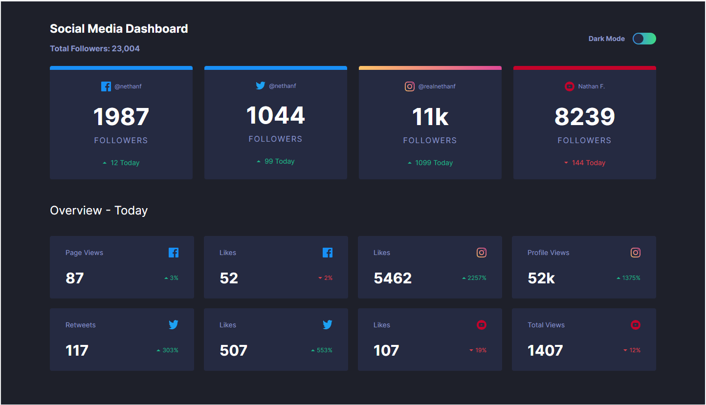
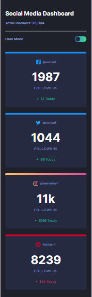
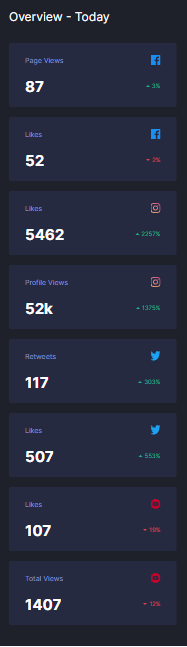
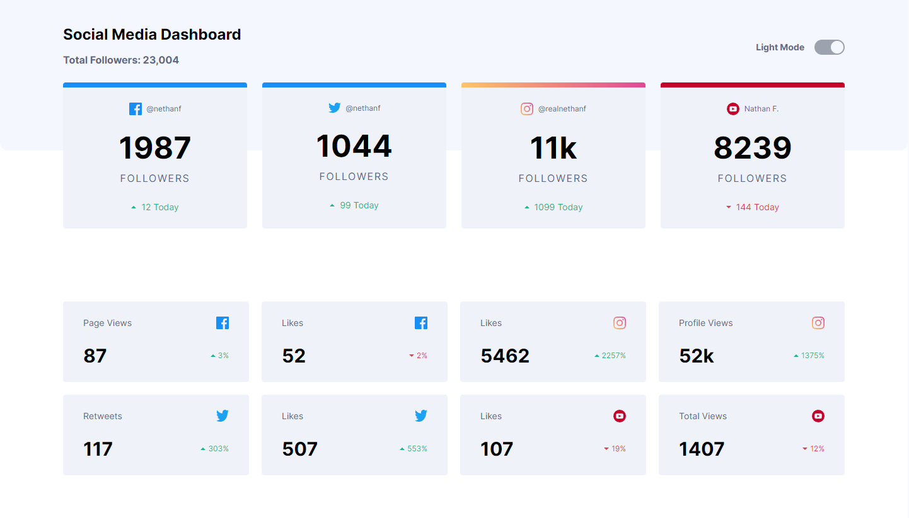
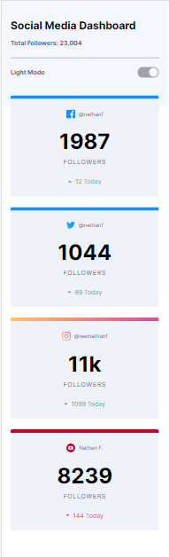
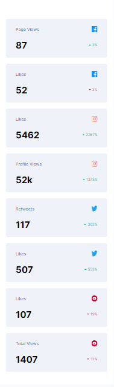

# Frontend Mentor - Social media dashboard with theme switcher solution

This is a solution to the [Social media dashboard with theme switcher challenge on Frontend Mentor](https://www.frontendmentor.io/challenges/social-media-dashboard-with-theme-switcher-6oY8ozp_H). Frontend Mentor challenges help you improve your coding skills by building realistic projects.

## Table of contents

- [Overview](#overview)
  - [The challenge](#the-challenge)
  - [Screenshots](#screenshots)
  - [Links](#links)
- [My process](#my-process)
  - [Built with](#built-with)
- [Author](#author)

## Overview

### The challenge

Users should be able to:

- View the optimal layout for the site depending on their device's screen size
- See hover states for all interactive elements on the page
- Toggle color theme to their preference

### Screenshots

### Links

- [Frontend Mentor solution](https://www.frontendmentor.io/solutions/social-media-dashboard-built-with-tailwind-ZQNzbvkGmD)
- [GitHub repo](https://github.com/RoksolanaVeres/Social-media-dashboard)
- [Live Site](https://social-media-dashboard-eight-ebon.vercel.app/)

## My process

### Built with

- Tailwind

## Author

- Frontend Mentor - [@RoksolanaVeres](https://www.frontendmentor.io/profile/RoksolanaVeres)
